# Traceable Homework

## Option 1: Setup docker desktop
Turn on k8s in docker desktop with all default settings (kubeadm).
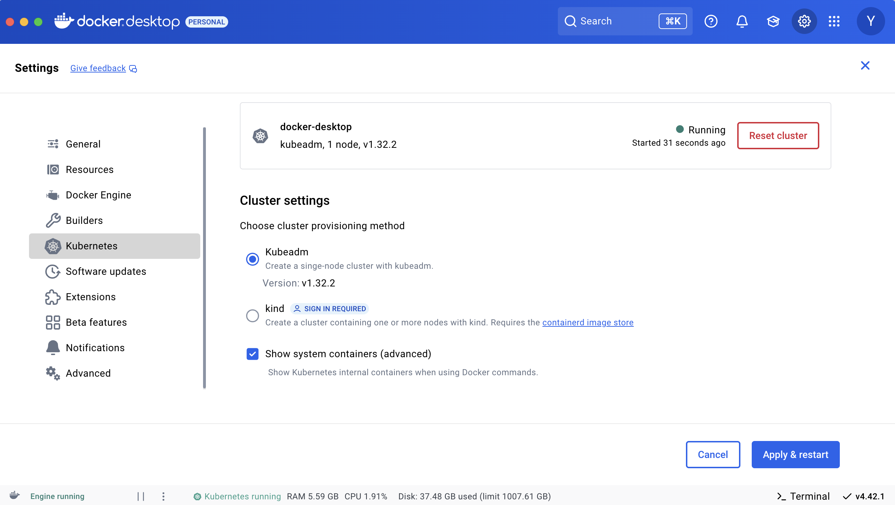  

Check the connectivity using kubectl.
```
alias k = kubectl
k cluster-info
Kubernetes control plane is running at https://127.0.0.1:6443
CoreDNS is running at https://127.0.0.1:6443/api/v1/namespaces/kube-system/services/kube-dns:dns/proxy

To further debug and diagnose cluster problems, use 'kubectl cluster-info dump'.
```

## Option 2: Create an EKS cluster
You can use AWS console or eksctl to create an basic EKS env. Be sure to add csi and vpc-cni addons. 
```
# show the role who will create the cluster
aws sts get-caller-identity
# create the cluster
eksctl create cluster -f eks/ubuntu.yaml
```
After eks deployed, check the kubectl config.
```
k cluster-info
Kubernetes control plane is running at https://BEF627996D888669320EEBC3614EC175.gr7.us-east-1.eks.amazonaws.com
CoreDNS is running at https://BEF627996D888669320EEBC3614EC175.gr7.us-east-1.eks.amazonaws.com/api/v1/namespaces/kube-system/services/kube-dns:dns/proxy

To further debug and diagnose cluster problems, use 'kubectl cluster-info dump'.
```
## Deploy crAPI
Follow the setup.md in [crAPI repo](https://github.com/OWASP/crAPI/blob/develop/docs/setup.md#kubernetes) to install the crAPI in docker k8s.
1. Clone the OWASP crAPI
  ```
  git clone git@github.com:OWASP/crAPI.git
  cd crAPI/deploy/helm
  ```
2. Install the crAPI services
``` 
helm install --create-namespace --namespace crapi crapi . --values values.yaml --set apiGatewayServiceInstall=false
NAME: crapi
LAST DEPLOYED: Mon Jun 30 12:46:23 2025
NAMESPACE: crapi
STATUS: deployed
REVISION: 1
TEST SUITE: None
```
3. Check the status of crAPI.
```
k get pod, svc -n crapi
NAME                                   READY   STATUS    RESTARTS   AGE
pod/crapi-community-5589f65994-klkg2   1/1     Running   0          98s
pod/crapi-identity-f4ffb86ff-r8vvm     1/1     Running   0          98s
pod/crapi-web-6895f64cfd-ctvrv         1/1     Running   0          98s
pod/crapi-workshop-668666d596-m94dm    1/1     Running   0          98s
pod/gateway-service-596556fbc9-zkkr5   1/1     Running   0          98s
pod/mailhog-648b95cc86-sdxz5           1/1     Running   0          98s
pod/mongodb-0                          1/1     Running   0          98s
pod/postgresdb-0                       1/1     Running   0          98s

NAME                          TYPE           CLUSTER-IP      EXTERNAL-IP   PORT(S)                      AGE
service/crapi-community       ClusterIP      10.97.11.102    <none>        8087/TCP                     98s
service/crapi-identity        ClusterIP      10.96.85.247    <none>        8080/TCP                     98s
service/crapi-web             LoadBalancer   10.100.41.150   localhost     80:30080/TCP,443:30443/TCP   98s
service/crapi-workshop        ClusterIP      10.102.143.57   <none>        8000/TCP                     98s
service/gateway-service       ClusterIP      10.98.169.34    <none>        443/TCP                      98s
service/mailhog               ClusterIP      10.107.2.60     <none>        1025/TCP                     98s
service/mailhog-web           ClusterIP      10.106.7.172    <none>        8025/TCP                     98s
service/mailhog-web-ingress   LoadBalancer   10.97.75.36     localhost     8025:30025/TCP               98s
service/mongodb               ClusterIP      10.105.228.83   <none>        27017/TCP                    98s
service/postgresdb            ClusterIP      10.97.241.79    <none>        5432/TCP                     98s
```

crAPI has a microservice architecture comprising of id provider, webapp, community, workshop, nosql db and rdb.  The API contains many vulnerabilities and is a good target for security practices.  We will use Postman to simulate attacks to crAPI service and use Traceable sidecar and ebpf tracer to mirror those attacks.  Those calls will be sent to Traceable.ai by the Traceable Platform Agent (TPA). 

## Setup istio gateway
1. Install istio.
```
curl -L https://istio.io/downloadIstio | sh -\n
cd istio-1.26.2
bin/istioctl install --set profile=default
```

2. Create gateway and visual service pointing to crapi
```
kubectl apply -f - <<EOF
apiVersion: networking.istio.io/v1
kind: Gateway
metadata:
  name: crapi-web
  namespace: crapi
spec:
  selector:
    istio: ingressgateway
  servers:
  - port:
      number: 80
      name: nginx
      protocol: HTTP
    hosts:
    - "*"
  - port:
      number: 8025
      name: web
      protocol: HTTP
    hosts:
    - "*"
---
apiVersion: networking.istio.io/v1
kind: VirtualService
metadata:
  name: crapi
  namespace: crapi
spec:
  hosts:
  - "*"
  gateways:
  - crapi-web
  http:
  - route:
    - destination:
        host: crapi-web.crapi.svc.cluster.local
EOF
```
3. Test the gateway access.
```
curl localhost:80
<!doctype html><html lang="en"><head><meta charset="utf-8"/><link rel="icon" href="/images/favicon.ico"/><meta name="viewport" content="width=device-width,initial-scale=1"/><meta name="theme-color" content="#000000"/><meta http-equiv="cache-control" content="no-cache"/><meta http-equiv="Pragma" content="no-cache"/><meta http-equiv="Expires" content="0"/><meta name="keywords" content="OWASP, API, Top 10, BOLA, IDOR, BFLA, Mass Assignment, Broken Object Level Authorization, Broken Function Level Authentication, Excessive Data Exposure, SSRF, Lack of Resources & Rate Limiting"/><meta name="description" content="completely ridiculous API (crAPI) will help you to understand the ten most critical API security risks. crAPI is intentionally vulnerable to the OWASP API Top 10, but you’ll be able to safely run it to educate/train yourself."/><link rel="apple-touch-icon" href="/images/logo192.png"/><link rel="manifest" href="/manifest.json"/><title>crAPI</title><script defer="defer" src="/static/js/main.86f8e427.js"></script><link href="/static/css/main.2a6fe1eb.css" rel="stylesheet"></head><body><noscript>You need to enable JavaScript to run this app.</noscript><div id="root"></div></body></html>
```
## Postman desktop
From postman.com, [download](https://www.postman.com/downloads/) and install postman on your desktop.

## Install traceable platform agent (helm)
1. Create an agent token on traceable and set the environment variables. If you want to protect a specific namespace, you can specify NAMESPACE env variable. In this case, it is 'crapi'.
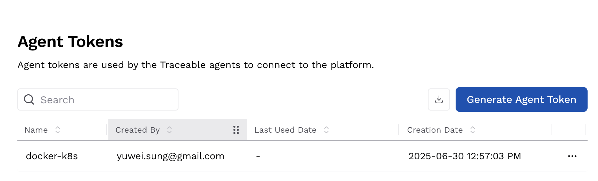
```
export TOKEN=xxxxxxxxxx
export ENV=YUWEI_SUNG
export ENDPOINT=api.us1.traceable.ai
export NAMESPACE=crapi
```
2. Deploy traceable platform agent
Note that if you choose istio sidecar, you just need to install TPA deployment. 
```
helm repo add traceableai https://helm.traceable.ai
helm repo update
helm install --namespace traceableai traceable-agent traceableai/traceable-agent --create-namespace --set token=$TOKEN --set environment=$ENV --set endpoint=$ENDPOINT
```
3. Check the status of deployment.
```
k get pod -n traceableai
NAME                               READY   STATUS    RESTARTS   AGE
traceable-agent-5765d45fc6-dz9sj   1/1     Running   0          13m
```
You can confirm the connection is correct by the traceable-agent log or Traceable UI.
## Inject sidecar tracer to istio ingress-gateway
1. Add 'traceableai-inject-tme=enabled" to istio-ingress-gateway namespace.
```
kubectl label ns istio-system traceableai-inject-tme=enabled
```
2. Add "tme.traceable.ai/inject":"true" annotations to ingress-gateway deployment.
```
kubectl patch deployment.apps/istio-ingressgateway -p '{"spec": {"template": {"metadata": {"annotations": {"tme.traceable.ai/inject": "true"}}}}}' -n istio-system
```
3. Add "traceableai-istio":"enabled" annotation to ingress-gateway deployment.
```
kubectl patch deployment.apps/istio-ingressgateway -p '{"spec": {"template": {"metadata": {"labels": {"traceableai-istio": "enabled"}}}}}' -n istio-system
```
4. Restart the ingressgateway (or kill the pod). After the ingress-gateway restarted, you should see two containers in the pod.
```
k describe pod istio-ingressgateway-54ccb7844f-m7f6h -n istio-system | grep -A5 'tme'
                  tme.traceable.ai/inject: true
                  traffic.kuma.io/exclude-outbound-ports: 5442,5442
                  traffic.sidecar.istio.io/excludeOutboundPorts: 5442,5442
Status:           Running
IP:               10.1.0.126
IPs:
--
  tme:
    Container ID:  docker://ea2eedfcd8b2d2b22571c3db4d3d4e85b93c0dd9a48e05e86de8096c496f665a
    Image:         docker.io/traceableai/traceable-agent:1.57.2
    Image ID:      docker-pullable://traceableai/traceable-agent@sha256:e2fba88ba0515c1bb85a0e5476f8d771707c58db08dd0133e3fa61c25152ce4e
    Port:          <none>
    Host Port:     <none>
```
## Optional: JAVA sidecar
Since istio sidecar is "edge" that only filter the traffic in and out of the gateway. It will be useful to have a java sidecar injected to the crAPI pods. 
1. Inject the java tracer agent to a deployment.
```
kubectl patch deployment.apps/crapi-web -p '{"spec": {"template": {"metadata": {"annotations": {"java.traceable.ai/inject": "true"}}}}}' -n crapi
```
2. Label the crapi namespace.
```
kubectl label namespace $NAMESPACE traceableai-inject-java=enabled
```
3. Rolling restart the deployment or kill the pod.
```
kubectl rollout restart deployment crapi-web -n crapi
```
4. Verify the agent is running
```
kubectl get po -n traceableai
```

## Install ebpf tracer agent
Be aware of namespaces where the tracer will monitor. Use daemonSetMirrorAllNamespaces=true to monitor other namespace. I believe there should be a configMap property to list namespaces.
```
helm install --namespace traceableai traceable-agent traceableai/traceable-agent \
      --set token=$TOKEN \
      --set environment=$ENV \
      --set runAsDaemonSet=false \
      --set daemonSetMirroringEnabled=true \
      --set daemonSetMirrorAllNamespaces=true \
      --set ebpfCaptureEnabled=true \
      --set ebpfRunAsPrivileged=true \
      --set ebpfDeployOnMaster=true \
      --set endpoint=$ENDPOINT
```
After the deployment, veryif the agent pods are running.
```
kubectl get pods -n traceableai
NAME                              READY   STATUS        RESTARTS   AGE
traceable-agent-bc79b55dd-m6j56   1/1     Terminating   0          66s
traceable-agent-f96b696c6-hpbpn   1/1     Running       0          20s
traceable-ebpf-tracer-ds-7h6m5    1/1     Running       0          20s
traceable-ebpf-tracer-ds-r4l4x    1/1     Running       0          20s
```

## Learning crAPI using Postman
1. Load the attached postman json and env json files to Postman. 
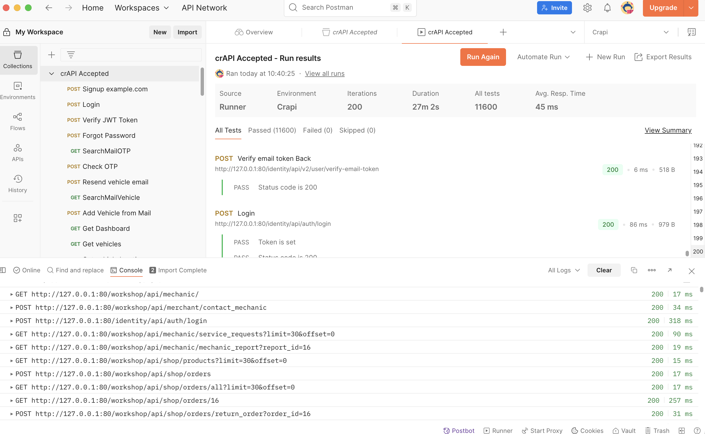
2. Change the api endpoint url and port according to the loadbalancer address in svc.
```
k get svc crapi-web -n crapi
NAME        TYPE           CLUSTER-IP      EXTERNAL-IP                                                               PORT(S)                      AGE
crapi-web   LoadBalancer   10.100.139.94   a2e286f1a203b4390b3aff18067eb62d-1544345541.us-east-1.elb.amazonaws.com   80:30080/TCP,443:30443/TCP   14m
```
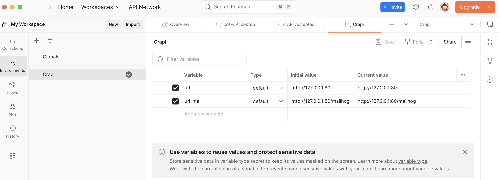
3. Run 200 iteration with 100ms delay (Learning)

## Check the Traceable UI
1. Once the sidecar or ebpf tracer created, you should find the Agent in Settings/Data Collection.
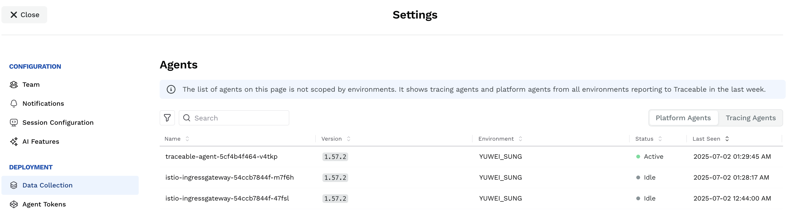
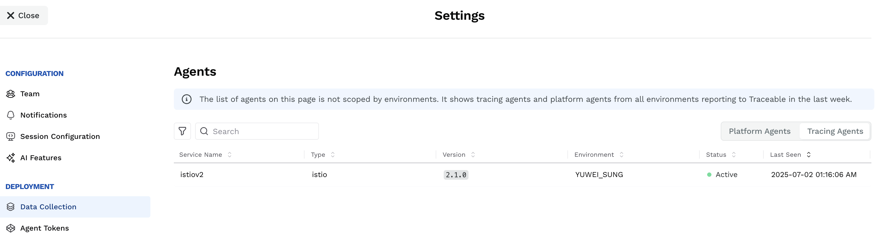

## Run the attack API calls
1. Load the pov.json attached to Postman and run the whole collction to simulate the attacks.
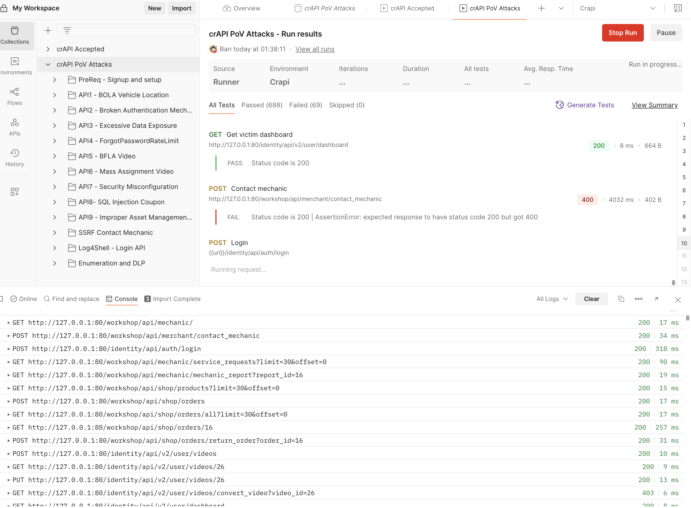

## Check the Traceable UI
0. Turn on AI feature
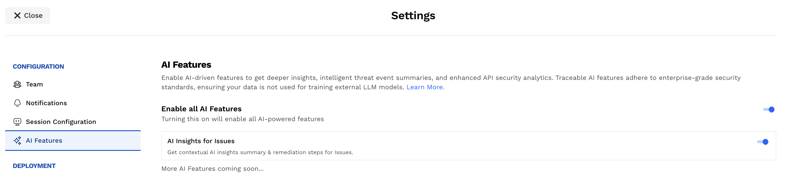
1. Catalog/API Discovery/API Activity
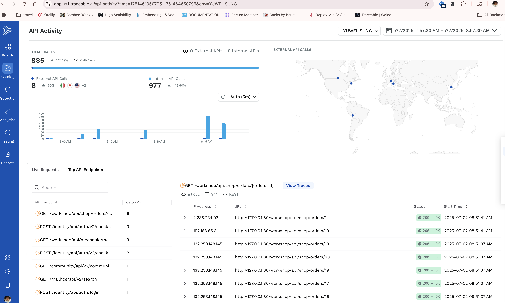
2. Protection/Web Application Protection
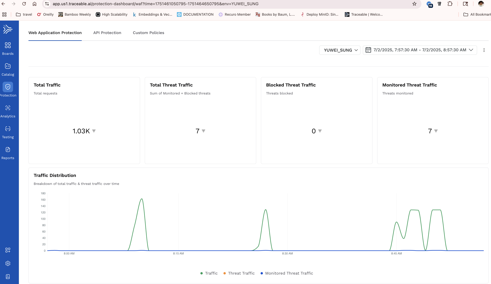
3. Analytics Explorer
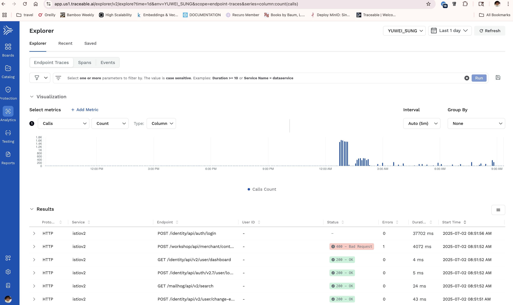


## Next step
* How to add analytics?
* How to take action (protection) or modify the current policy from warning to action like rate-limit?
* how to run test with istio sidecar mode?
* learn issue policies
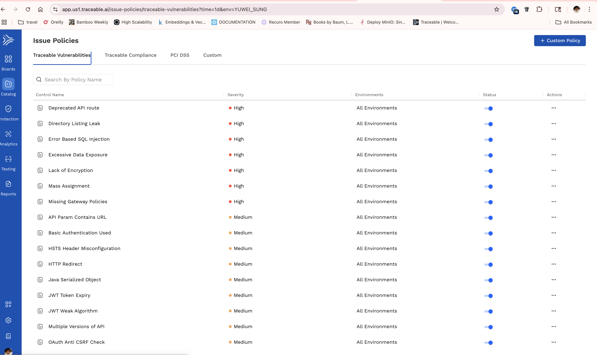